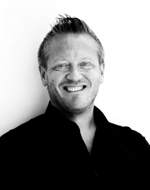
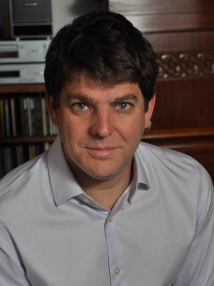

The event will feature the following international speakers:

## <i class="fas fa-user" style="color:var(--theme-color)"></i> Patrizio Pelliccione

{width="200"}

Patrizio Pelliccione has an academic and educational background in Software Engineering and Computer Science covering both solution-oriented and knowledge-oriented research. He has been working in different countries and contexts and he has a consolidated experience on National (Italian, Swedish, Luxembourgish) and EU projects. He is very active in the research community and he collaborate with various companies around the world.
The three main research areas in which he is working are (i) autonomous, self-adaptive, and smart systems, (ii) robotic Software engineering and (iii) architecting complex system.

Read more about Dr. Patrizio Pelliccione in [his web page](https://www.patriziopelliccione.com/)

## <i class="fas fa-user" style="color:var(--theme-color)"></i> Sebastian Uchitel

{width="200"}

Sebastian Uchitel holds a Readership at Imperial College London and is currently also ad-honorem professor at University of Buenos Aires and CONICET. He currently also on the board of the national argentine oil company, YPF. He received his undergraduate computer science degree from University of Buenos Aires and his Phd in Computing from Imperial College London. His research interests are in behavior modeling and analysis of requirements and design for complex software-intensive systems. Dr. Uchitel was associate editor of IEEE Transactions on Software Engineering and is currently associate editor of the Requirements Engineering Journal and the Science of Computer Programming Journal, he was program co-chair of the 21st IEEE/ACM International Conference on Automated Software Engineering and of the 32nd IEEE/ACM International Conference on Software Engineering (ICSE 2010).

Read more about Dr. Sebastian Uchitel in [his web page](https://www.imperial.ac.uk/people/s.uchitel)

## <i class="fas fa-calendar-check" style="color:var(--theme-color)"></i> Keynotes Schedule

Check the [program](/RoME/program) for the keynotes schedule

