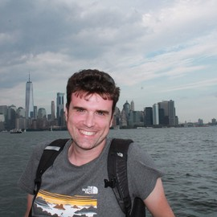
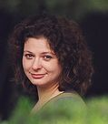

The event will feature the following international speakers:

## <i class="fas fa-user" style="color:var(--theme-color)"></i> Patrizio Pelliccione

{width="200"}

Patrizio Pelliccione has an academic and educational background in Software Engineering and Computer Science covering both solution-oriented and knowledge-oriented research. He has been working in different countries and contexts and he has a consolidated experience on National (Italian, Swedish, Luxembourgish) and EU projects. He is very active in the research community and he collaborate with various companies around the world.
The three main research areas in which he is working are (i) autonomous, self-adaptive, and smart systems, (ii) robotic Software engineering and (iii) architecting complex system.

Read more about Dr. Patrizio Pelliccione in [his web page](https://www.patriziopelliccione.com/)

## <i class="fas fa-user" style="color:var(--theme-color)"></i> Sebastian Uchitel

{width="200"}

Sebastian Uchitel holds a Readership at Imperial College London and is currently also ad-honorem professor at University of Buenos Aires and CONICET. He currently also on the board of the national argentine oil company, YPF. He received his undergraduate computer science degree from University of Buenos Aires and his Phd in Computing from Imperial College London. His research interests are in behavior modeling and analysis of requirements and design for complex software-intensive systems. Dr. Uchitel was associate editor of IEEE Transactions on Software Engineering and is currently associate editor of the Requirements Engineering Journal and the Science of Computer Programming Journal, he was program co-chair of the 21st IEEE/ACM International Conference on Automated Software Engineering and of the 32nd IEEE/ACM International Conference on Software Engineering (ICSE 2010).

Read more about Dr. Sebastian Uchitel in [his web page](https://www.imperial.ac.uk/people/s.uchitel)

## <i class="fas fa-user" style="color:var(--theme-color)"></i> Claudio Menghi

{width="200"}

Claudio Menghi earned his BSc and MSc degrees in computer science from the Politecnico di Milano, where he later completed his Ph.D. under the guidance of Prof. Carlo Ghezzi in 2015. Transitioning to the academic realm, Claudio ventured into Postdoctoral Research at the University of Gothenburg and Chalmers from 2017 to 2018. Following this, he assumed the role of Research Associate at the Interdisciplinary Centre for Security, Reliability, and Trust, University of Luxembourg, from 2018 to 2021. In 2021, Claudio Menghi took on the role of Assistant Professor at McMaster University, and subsequently, in 2023, he expanded his academic journey as an Assistant Professor at the University of Bergamo. Not content with just one academic home, Claudio also serves as an Adjunct Professor at McMaster University.

Read more about Dr. Claudio Menghi in [his web page](https://claudiomenghi.github.io/)

## <i class="fas fa-user" style="color:var(--theme-color)"></i> Marsha Chechik

{width="200"}

Marsha Chechik is a professor (former Chair, 2019-22) in the Department of Computer Science at the University of Toronto, Canada, and holds a significant role in academia. She served as the Acting Dean of the Faculty of Information from July to December 2022, extending her influence beyond the Computer Science realm. Her primary interests revolve around Software Engineering, focusing on Safety and Security Assurance, Automated Verification, Software Product Lines, and Model Management. Her research pursuits delve into applying formal methods to elevate software quality. This encompasses scalable, automated verification techniques such as model-checking and theorem-proving, user-friendly formal specification languages for easy comprehension and review, protocol verification, exploration of non-classical logic, and adept reasoning under inconsistency.

Read more about Dr. Marsha Chechik in [her web page](https://www.cs.toronto.edu/~chechik/)

## <i class="fas fa-calendar-check" style="color:var(--theme-color)"></i> Keynotes Schedule

Check the [program](/RoME/program) for the keynotes schedule

