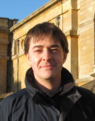

The event will feature the following international speakers:

## <i class="fas fa-user"></i> Patrizio Pelliccione

{width="200"}

Patrizio Pelliccione has an academic and educational background in Software Engineering and Computer Science covering both solution-oriented and knowledge-oriented research. He has been working in different countries and contexts and he has a consolidated experience on National (Italian, Swedish, Luxembourgish) and EU projects. He is very active in the research community and he collaborate with various companies around the world.
The three main research areas in which he is working are (i) autonomous, self-adaptive, and smart systems, (ii) robotic Software engineering and (iii) architecting complex system.

Read more about Dr. Patrizio Pelliccione in [his web page](https://www.patriziopelliccione.com/)

## <i class="fas fa-user"></i> Radu Calinescu

{width="200"}

Radu Calinescu is a Professor of Computer Science at the University of York, PI on the UKRI Trustworthy Autonomous Systems Node in Resilience, the Assuring Autonomy International Programme Safety of AI Theme Lead, and the lead of the Trustworthy Adaptive and Autonomous Systems and Processes (TASP) Research Team.

His main research interests are in formal modelling, analysis, verification and controller synthesis for autonomous and self-adaptive systems and processes; parametric and probabilistic model checking automated;
and model-driven software engineering.

Read more about Dr. Radu Calinescu in [his web page](https://www-users.york.ac.uk/~rcc516/)

## <i class="fas fa-calendar-check"></i> Keynotes Schedule

Check the [program](/program) for the keynotes schedule

